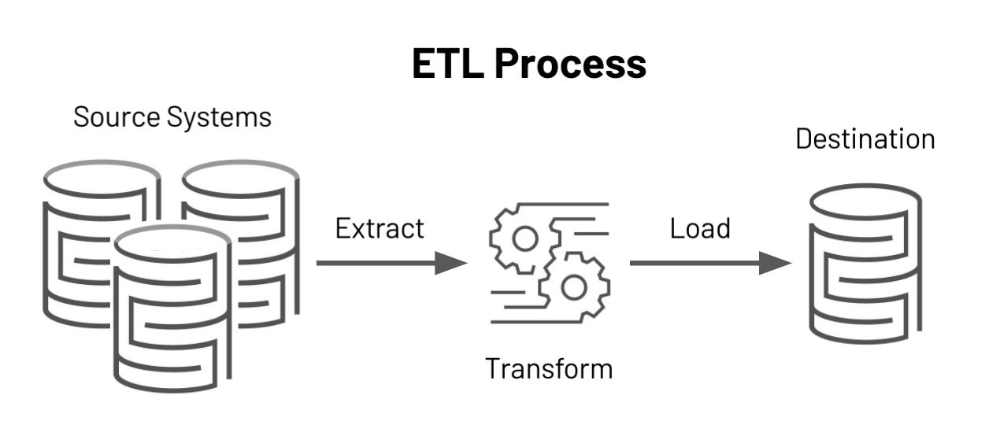

```{r xaringanthemer, include = FALSE}
#devtools::install_github("gadenbuie/xaringanthemer")
library(xaringanthemer)
library(tidyverse)

mono_light(
  base_color = "#1c5253",
  header_font_google = google_font("Modelica", "300", "300i"),
  text_font_google   = google_font("Modelica", "300", "300i"),
  code_font_google   = google_font("Modelica", "300", "300i"),
  text_color = "black",
  text_bold_color = TRUE,
  text_font_size = ".7cm",
  code_font_size = ".6cm"
  #text_font_size = 15
  )
```

```{r setup, include=FALSE}
knitr::opts_chunk$set(echo = TRUE, warning = F, message = F)
knitr::opts_chunk$set(fig.height = 6, out.width = "100%", comment = " ", cache = T, dpi = 300)
options(scipen = 9999)
options(max.print = 100)


source("https://raw.githubusercontent.com/EvaMaeRey/little_flipbooks_library/master/xaringan_reveal_parentheses_balanced.R")


```


class: middle, center
# ¿Qué es [Tidyverse](https://www.tidyverse.org/)?

---

class: middle, center

#### `Tidyverse` es una colección de paquetes de R, diseñados para la ciencia de datos. 

---

class: middle, center

#### Algunas librerías que contiene `Tidyverse`
```{r echo=FALSE, out.width = '50%', fig.align = 'center'}
knitr::include_graphics("tidyverse-icons.png")
```

---


## Procesos de ETL:

* Tidyverse provee las herramientas básicas para realizar operaciones en Data Sciences:
+ `Extract` (extraer información)  
+ `Transform` (transformar los data frames a partir de las funciones que proveen las distintas librerías)  
+ `Load` (cargar nuevamente esas bases extraídas y transformadas)  

```{r echo=FALSE, out.width = '50%', fig.align = 'center'}

```
---
## Funciones del paquete dplyr:

<br>

| __Función__   | __Acción__ |
| :---          | ---:   |
| `select()`    | *selecciona o descarta variables*|
| `filter()`    | *selecciona filas*|
| `mutate()`    | *crea / edita variables*|
| `rename()`    | *renombra variables*|
| `group_by()`  | *agrupa en funcion de una o más variables*|
| `summarise()` | *genera una tabla de resúmen*|

---

## __Pipe__
***

El "pipe" será es el comando por el cual podemos anidar funciones en una misma línea de código:  
`%>%`  
Y se muestra presionando __control + shift + m__ 

---

class: middle, center

# __select()__
***
#### _Elije o descarta columnas de una base de datos_

---
class: middle, left

La función se ejecuta de la siguiente manera:
```r 
select(data_frame,
        columna1,columna2, etc...)
```
<br>

Otro modo es el siguiente:
```r 
data_frame %>% 
  select(columna1,columna2, etc...)
```
Al pararnos sobre el data frame antes de usar la función R ya no necesita que le aclaremos dónde va a operar, por lo tanto podemos obviar el argumento del data frame.

---
## Ejemplo de select()

Primero cargamos una base de datos (vacunación en caba COVID 19):
```{r }
# fuente: https://data.buenosaires.gob.ar/dataset/plan-de-vacunacion-covid-19
df <- read.csv("dataset_total_vacunas.csv")

```
--
<br>

La funcion `colnames()` nos va a mostrar los _nombres_ de las columnas del data frame:

```{r }
colnames(df)

```

---
Sabiendo los nombres de las columnas, podemos crear un nuevo data frame que contenga solo las columnas que nos interesa trabajar:

```{r }

df_recortado <- df %>% 
  select("FECHA_ADMINISTRACION", "GENERO","GRUPO_ETARIO","TIPO_EFECTOR")

```

Con la función `head()` podemos ver las primeras filas del df:
```{r }
head(df_recortado)

```

---
class: middle, center

##Otra forma de selecionar es a través de la numeración de las columnas:

---
```{r sel2, eval = F, echo = F}
df %>% 
  select(1:4)
```

`r apply_reveal("sel2")`

---
class: middle, center

## En la selección, damos el orden de las columnas
<br>
## También podemos utilizar vectores para seleccionar columnas:

---
```{r sel3, eval = F, echo = F}
df %>% 
  select(c(1,4,6))
```

`r apply_reveal("sel3")`

---

class: middle, center

# __filter()__

***

#### _Filtra casos (filas) de una base de datos en función de una o más variables_

Recordemos que en R Base filtrábamos de la siguiente manera:

```r
df$variable[df$variable == 'categoria']
```
---

- En `tidyverse`:
```r
df %>% 
  filter(variable == 'categoria')
```
---

Supongamos que queremos quedarnos sólo con los efectores públicos que aplicaron vacunas contra Covid-19 en CABA:

---
```{r fil1, eval = F, echo = F}
df %>% 
  select(2:5) %>% 
  filter(TIPO_EFECTOR == 'Público')
```

`r apply_reveal("fil1")`

---
Podemos utilizar operadores lógicos para mejorar los filtros:
---

```{r fil2, eval = F, echo = F}
df %>% 
  select(2:5) %>% 
  filter(TIPO_EFECTOR == 'Público'| TIPO_EFECTOR =='Público nacional')
```

`r apply_reveal("fil2")`


---
class: middle, center

# __mutate()__

***

---

#### _Esta función crea nuevas variables (columnas) o transforma las existentes_

---

```r
df %>% 
   mutate(var_nueva = as.numeric(variable1))
```
---
class: center, middle

Supongamos que queremos una nueva variable que nos indique el total de vacunas que se aplicaron por fila
---
```{r mut1, rows.print=10, col.print=10, eval = F, echo = F}
df %>% 
  select("DOSIS_1", "DOSIS_2", "DOSIS_3") %>% 
  mutate(total_aplicadas = DOSIS_1 + DOSIS_2+ DOSIS_3)
```

`r apply_reveal("mut1")`

---
class: center, middle

## Mutate también permite editar una variable existente.
---
```{r mut2, rows.print=10, col.print=10, eval = F, echo = F}

df %>% 
  mutate(FECHA_ADMINISTRACION = str_sub(FECHA_ADMINISTRACION, 1,9))
  #La función str_sub() la veremos en la clase 4

```

`r apply_reveal("mut2")`

---

class: middle, center

# __rename()__

***

#### _Asigna un nuevo nombre a variables existentes_

---

```r
df %>% 
   rename(var_nueva = var_vieja)
```
---

class: center, middle

```{r ren1, eval = F, echo = F}
df %>% 
  select(1:5) %>% 
  rename(Aplicacion = FECHA_ADMINISTRACION,
         Marca_vacuna = VACUNA,
         Intervalo_Edad = GRUPO_ETARIO)
```

`r apply_reveal("ren1")`

---

class: middle, center

# __arrange()__

***

#### _Ordena el data frame según la variable que indiquemos_

Por defecto va a ordenar de manera ascendente

---

```r
df %>% 
   arrange(variable)
```

<br>

Si queremos que ordene de manera descendente, debemos agregar desc() o - a arrange()

<br><br>
```r
df %>% 
   arrange(desc(variable))
```
<br><br>

```r
df %>% 
   arrange(-variable)
```
---

```{r orden1, eval = F, echo = F}
df %>% 
  select(5:7) %>% 
  arrange(DOSIS_1) %>% 
  arrange(desc(DOSIS_1))
```

`r apply_reveal("orden1")`

---
class: middle, center

# __summarise()__

***

#### _Crea una variable resumen una nueva tabla_

---

<br><br>
<br><br>

```r
df %>% 
        summarise(var1_resumen = sum(var1),
                  var2_media   = mean(var2),
                  var2_desvio  = sd(var2))
```
---

```{r summarise1, eval = F, echo = F}
df %>% 
  summarise(total_dosis_1 = sum(DOSIS_1),
            total_dosis_2 = sum(DOSIS_2),
            total_dosis_3 = sum(DOSIS_3, na.rm = TRUE))
```

`r apply_reveal("summarise1")`
---
class: middle, center

# __group_by()__

***

#### _Agrupa a partir de una o más variables seleccionadas_


---

<br><br>
<br><br>

```r
df %>% 
        group_by(var1)
```

---
class: center, middle
Agrupemos por género para saber el total de las 1eras dosis aplicadas:

---

```{r group1, eval = F, echo = F}
df %>% 
  group_by(GENERO) %>% 
  summarise(TOTAL_DOSIS_1 = sum(DOSIS_1),
            TOTAL_DOSIS_2 = sum(DOSIS_2),
            TOTAL_DOSIS_3 = sum(DOSIS_3, na.rm=TRUE),
            TOTAL_APLICADO = TOTAL_DOSIS_1 + TOTAL_DOSIS_2 +TOTAL_DOSIS_3)
```

`r apply_reveal("group1")`

---
# __pivot_longer()__
***
#### _Reestructura la base, apilando en una columna varias columnas_

---

```{r group12}

df %>% 
  group_by(GENERO)  %>% 
  summarise(TOTAL_DOSIS_1 = sum(DOSIS_1),
            TOTAL_DOSIS_2 = sum(DOSIS_2),
            TOTAL_DOSIS_3 = sum(DOSIS_3, na.rm=TRUE)) %>% 
 pivot_longer(2:4, names_to = "DOSIS", values_to = "Total")

```

---

class: middle, center

# __pivot_wider()__
***
#### _Reestructura la base, apilando en varias columnas a una  por cada categoría de la misma_

---

```{r pivot2}

        
df %>% 
  group_by(GENERO) %>% 
  dplyr::summarise(TOTAL_DOSIS_1 = sum(DOSIS_1),
            TOTAL_DOSIS_2 = sum(DOSIS_2),
            TOTAL_DOSIS_3 = sum(DOSIS_3, na.rm=TRUE)) %>% 
  pivot_longer(2:4, names_to = "DOSIS", values_to = "Total") %>% 
  pivot_wider(names_from = "DOSIS", values_from = "Total")


```

---

class: center, middle

# __¡A codear!__